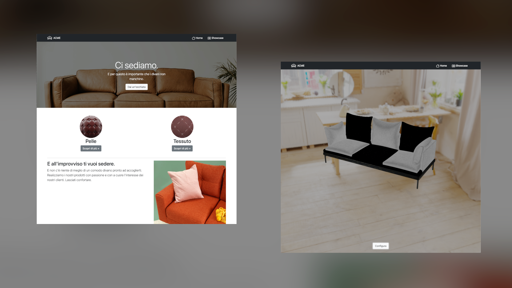

# Product Configuration

    

This repository constains the project developed by Francesco Bombassei De Bona and Andrea Cantarutti (A.A. 2020/2021) and based on the second assignment of the Interactive 3D Graphics course.

## Description

The project consist of a web application that simulates an e-commerce website and provides a **web-visualizer** in order to let the user configure the product according to his preferences. 

We decided to base our work on a company that sells **Sofas**. The homepage gives a brief presentation of **ACME** and the showcase page provides a threejs scene in which the user is able to inspect the product from every angle. A **menu button** allows to user to switch materials for different components.

Of course, the web application doesn't aim to implement a fully functional e-commerce website, but instead aims to give some context to the product visualizer in order to test how it would fit in a **real-life environment**. 

## Repository structure

All the work can be found inside the `website` directory. This contains: 

- `cubemap` (directory that contains the Environment Map used)
- `images` (directory that contains all the images used within the website)
- `libs` (directory that contains all the library used)
- `materials` (directory that contains all the textures used)
- `obj` (directory that contains the object model used)
- `style.css` (stylesheet file used within the website)
- `header.html` (navbar for the website pages)
- `index.html` (website's landing page)
- `showcase.html` (website's page that provides the product configurator)
- `showcase.js` (threejs code that implements the product configurator)

In the main folder you can also find: 

- The original assignment (`assignment.md`)
- The journal we kept while working on the project (`journal.md`)
- The medias used for this report (inside `media` folder)

## Object and Textures

Since we decided to work on a sofa company, we searched for a well-made 3D model of a couch. We decided to use [this one](https://www.cgtrader.com/free-3d-models/furniture/sofa/couch-williams-302), which is under a **royalty free license** as the [CGTrader](https://www.cgtrader.com/) website states. 

The textures used are all **public domain** and have been download from [ambientCG](https://ambientcg.com/), we decided to use: 

- Four varieties of Fabric materials
- Two varieties of Leather materials
- A metal texture for the sofa's legs
- A metal and a wooden texture for the sofa's base 

## Environment Map 

We used an environment map which represent a domestic settings in order to place the product in the environment it belongs to. The map was downloaded as a HQ cube map (and later scaled to a proper resolution in order to avoid long loading times) from [Poly Haven](https://polyhaven.com/a/studio_country_hall) under a [CC0](https://wiki.creativecommons.org/wiki/CC0_FAQ) (public domain) license.

## Lights

In order to properly illuminate the product, we decided to use **eight Point Lights** positioned on all the vertices of an imaginary cube (as shown in the following picture, where the lights sources are represented as wireframe spheres).

    

## Shaders

In order to represent the different features of the materials used, we wrote four different fragment shaders and a single vertex shader. These can be found inside the `showcase.html` file. 

Our work was inspired by Google's [Filament](https://google.github.io/filament/Filament.html), a PBR enginge for Android devices whose goal is to offer tools for high quality 3D render with ease.

### Wood shader

This is the shader we used to represent the wooden base of the sofa. It calculates both the **specular** and the **diffuse** componentes by using respectively a **Microfacet BRDF** and a **Lambertian BRDF** for each one of the lights included in the scene. 

As suggested by Filament, the Microfacet BRDF uses a **reflectance** which is set to 0.5 to give the wooden texture a polished finish and **<i>f</i>0** (the amount of light reflected back at normal incidence) was calculated as 0.16 multiplied by the **reflectance2**.

### Metal shader

This is the shader we used to represent the sofa's legs and the metal base. It calculates the specular component only, by using a generic **Microfacet BRDF** for each one of the lights included in the scene. Then, it adds the environment light by multiplying the final color by the **envLight** parameter.  

### Leather shader

This is the shader we used to represent the two leather options for the sofa's pillows. It calculates the specular component using a generic **Microfacet BRDF** and the diffuse component by using a **Lambertian BRDF**. In this case, **cspec** is calculated by using a **specular map** of the texture that we created using [Gimp](https://www.gimp.org/). 

### Cloth shader

This is the shader we used to represent all the fabric options for the sofa's pillows. It calculates the specular and diffuse components by using different BRDFs proposed by Filament at the [Cloth Model](https://google.github.io/filament/Filament.html#figure_materialcloth) chapter of its guide. 

## User interaction

In order to let the user interact with the product, we built a **modal menu** which can be accessed by clicking the button at the bottom of the scene. The menu allows the user to select: 

- The first group of pillows (with the base pillow)
- The second group of pillows (with the backrest)
- The lateral pillows
- The base material

Once the user has selected his favourite options, these are immediatly applied to the model and the user can close the menu to check out the differences.

Here's the **complete menu**:

    

and here are a few of the **possible configurations** (but many others are possible!):

 

 

 

## Tonemapping

At the end we decided to apply some **tonemapping** to our renderer. After some experiments, we decided to use the **Cineon** type. In fact, it allows the user to focus on the product without being distracted by the surrounding environment. 

## Performances

We were happy to see that our scene performs **flawlessly** on desktops and laptops. On an average smartphone ([Redmi Note 7 Pro](https://www.gsmarena.com/xiaomi_redmi_note_7-9513.php)) the framerate varies between 45 and 60 fps, on a high-end smartphone ([iPhone 11](https://www.gsmarena.com/apple_iphone_11-9848.php)) the framerate is constantly at 60 fps. Moreover, the responsiveness of the website makes the product configurator usable even from small devices.

We are happy with the result we obtained.

## Run the website

In order to explore our work, you only have to run an http-server from the `website` folder and access `localhost` on your browser. At the time of writing, a demo is avaiable at [this](https://interactive-3d.s3.eu-south-1.amazonaws.com/website/index.html) link.

