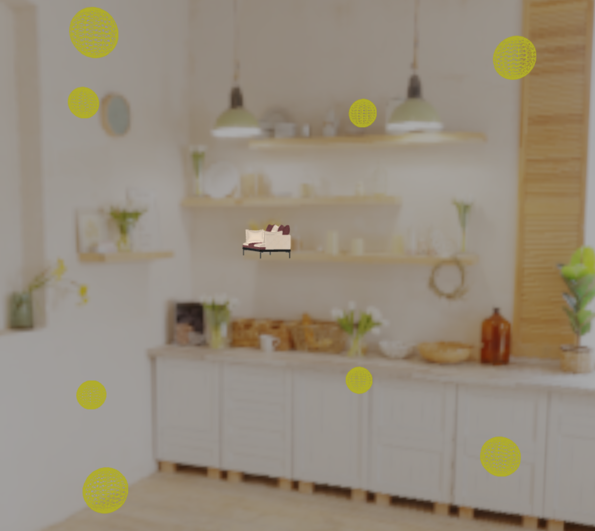
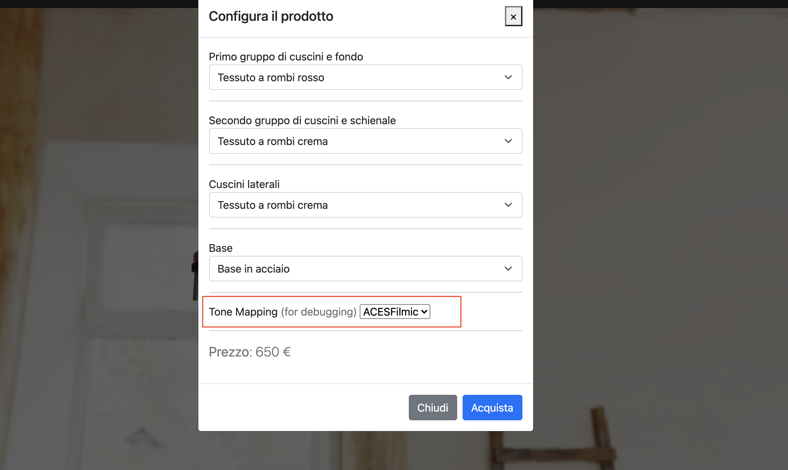

# Journal

This journal's aim is to present and describe the strategies and decisions chosen for this project.

## Choosing the product

After thinking about it for a while, we decided that **ACME** has asked us to configure their e-commerce site in order to sell their sofas.

## Giving some context

We are going to build a website with a classic **homepage** and a **showcase** menu that allows the user to interact with the scene by orbitating around the sofa and choosing models and textures.

## Building the website

In order to implement the website's home page and the showcase we used tools from different sources: 

- [JQuery](https://jquery.com/)
- [Bootstrap](https://getbootstrap.com/) (MIT License)
- [Bootstrap Icons](https://icons.getbootstrap.com/) (MIT License)
- [Unsplash pictures](https://unsplash.com/) (for pictures of sofas), credits to:
  + Paul Weather
  + Hutomo Abrianto
  + Sven Brandsma
  + Kari Shea

## Object model

As our main sofa we decided to use a cool one we found [here](https://www.cgtrader.com/free-3d-models/furniture/sofa/couch-williams-302) under a **royalty free license** on the [CGTrader](https://www.cgtrader.com/) website.  

## Textures

All the textures used have been downloaded from [ambientCG](https://ambientcg.com/), which is a website that provides public domain licensed materials for physically based rendering.
We chose four alternatives of Fabric, two of Leather, two of Metal and one of Wood. Later on, the user will be able to choose different textures for every component of the sofa.

## Environment Map

As requested, we added an environment map to our showcase. Particularly, we used a 360 map that we converted to a **cube map**, downloaded from the [Poly Haven](https://polyhaven.com/a/studio_country_hall) website under a [CC0](https://wiki.creativecommons.org/wiki/CC0_FAQ) (public domain) license.

We had, by the way, to scale the map a bit and give up some quality in order to allow the map to load faster. Unfortunately, the HQ map takes a lot of time to load up and that is not compatibile with the implicit requirements of a good web application. 

## Choosing the shaders

First of all, we based our shading work on the fragment shader of the `l15-shadingWithTextures.html` code. While searching online, we found about Google's [Filament](https://google.github.io/filament/Filament.html), a PBR enginge for Android whose goal is to offer tools for high quality 3D render with ease. On it's website, developers accurately present some of the Math behind Filament and the **BRDF**s equations used for specific surfaces. 

We found out about the [Cloth model](https://google.github.io/filament/Filament.html#materialsystem/clothmodel), whose aim is to represent loosely connected threads that absorb and scatter incident light (for example, a couch). The cloth **specular BRDF** is a modified microfaced BRDF, while the cloth **diffuse BRDF** is a slight modification of a Lambertian diffuse BRDF.

We also find out about the **Leather model**, the **Metal model** and the **Wood model** that we used to reproduced variety of pillows, the sofa legs and the sofa base too.

We were able to integrate this code in our fragment shaders, that also involves multiple lightning, environment map and texture usage.

## Lights

In order to add proper lightning to our scene we decided to include eight **point lights** that enlight the couch's surface from eight different angles. This allows the viewer to always look at a fully illuminated sofa since he will be able to orbitate around it inside the scene.

## Creating the configuration menu

In order to let the user choose his configuration, we decided to structure the showcase page as follows:

- Navigation bar on top
- Full screen Threejs scene that allows the user to orbit around the object and zoom in and out
- Menu button positioned at the bottom/center of the scene.

When the user selects the menu button, a modal pops in and lets you select:

- Base material
- First set of pillows material
- Second set of pillows material
- Lateral pillows material

## Some testing

We are now doing some testing on different devices and browsers and we're happy to see that the performances are really good even on average smartphones and that the usability is ok even from smartphones.

On a retina display with a 60 Hz refresh rate the scene reaches a constant value of **60 fps**.

On an iPhone 11 display with a 60 Hz refresh rate the scene keeps a constant value of **60 fps** too.

## Some post-processing work

After experimenting for a while with tone mapping options, we are trying to evaluate the best option in order to add a proper tone mapping. We want to let the user focus on the sofa, but without loosing the featurs of the environment that surrounds it. 

We based our choice on this [example](https://github.com/mrdoob/three.js/blob/master/examples/webgl_tonemapping.html) by **mrdoob**, which is also one of the [threejs examples](https://threejs.org/examples/#webgl_tonemapping) and lets the user choose between different kinds of tonemapping. 

We applied the same feature for debugging purposes to our menu and we were able to confront different mappings. 

This is how it looks like:

We decided that the **Cineon** tone mapping was the best choice for our purposes, because allows the user to focus on the product without being distracted by the Environment Map.

